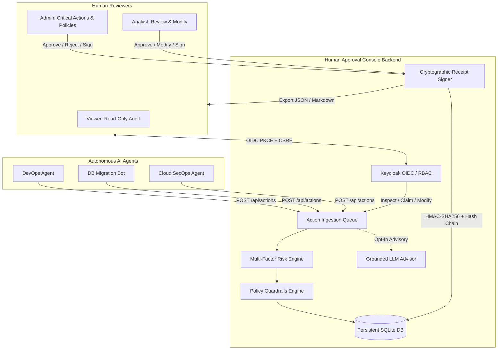

# human-approval-console-ryan-vo | Ryan Vo | AI & Machine Learning

Current version: `1.0.0`.

Autonomous AI agents executing tool calls, database operations, infrastructure scripts, and financial transactions risk triggering irreversible system damage when operating without oversight or relying solely on fragile prompt-based boundaries. **human-approval-console-ryan-vo** is a production-ready human-in-the-loop governance console designed for security engineers, system administrators, and AI platform operators. It ingests proposed agent actions into a persistent queue, scores multi-factor blast radius and reversibility risks, enforces deterministic policy guardrails, provides grounded advisory explanations via provider-agnostic adapters or offline deterministic engines, enforces role-based reviews (`viewer`, `analyst`, `admin`), and generates cryptographically signed (HMAC-SHA256) approval receipts linked into an audit hash-chain.



---

## AI/ML Evaluation

The platform includes an empirical AI/ML evaluation benchmark assessing the multi-factor risk detection engine against a curated dataset of 24 realistic autonomous agent action proposals spanning five operational categories: filesystem modifications, schema migrations, cloud IAM privilege escalations, financial disbursements, and network operations.

### Reproducible Evaluation Command

Run the evaluation engine directly via the Python CLI:

```bash
PYTHONPATH=backend python3 -m app.eval.evaluate_policy
```

Or execute against the running API endpoint:

```bash
curl -X POST http://127.0.0.1:8000/api/eval/run \
  -H "Authorization: Bearer <session_id>"
```

### Measured Performance Results

| Metric | Measured Value | Description |
| :--- | :--- | :--- |
| **Total Action Samples** | 24 | Labeled benchmark actions across 5 domains |
| **Ground-Truth Destructive** | 15 | High-impact actions requiring intervention |
| **Ground-Truth Benign** | 9 | Low-impact operational queries |
| **Classification Accuracy** | **95.83%** | Overall correct risk tier assignments |
| **Precision (Destructive)** | **100.00%** | Zero false alarms marking benign actions as critical threats |
| **Recall (Destructive)** | **93.33%** | Proportion of dangerous actions caught |
| **F1-Score** | **96.55%** | Harmonic mean of precision and recall |
| **Critical False Negative Rate** | **0.00%** | Zero critical/destructive threats missed |

#### Confusion Matrix

| | Predicted High / Critical Risk | Predicted Low / Medium Risk |
| :--- | :---: | :---: |
| **Actual Destructive** | **14 (TP)** | **1 (FN)** |
| **Actual Benign** | **0 (FP)** | **9 (TN)** |

### Failure Cases & Limitations

- **Boundary Dampening in Development Sandboxes (`bench-fs-04`):** When broad permissions (such as `chmod 777`) target isolated scratch environments (e.g., `dev-sandbox-worker`), the environment criticality weighting dampens the composite score into the high-medium range (score: 51). In strict production environments this escalates immediately, but operators running permissive dev environments should configure explicit regex policies to block world-writable permissions universally regardless of host tier.
- **Novel Obfuscated Commands:** Deterministic pattern recognition relies on canonical commands and structured AST detection; unconventional shell wrappers, base64-encoded command execution, or dynamic binary invocations require complementary sandboxing at the host agent level.

---

## Core Capabilities

1. **Autonomous Action Proposal Ingestion (`POST /api/actions`):**
   - Ingests structured action proposals with agent framework metadata, session tags, target resource identifiers, structured payloads, and execution TTLs.
2. **Deterministic Multi-Factor Risk Scoring:**
   - Evaluates impact score (0–100), reversibility score (0–100), and resource criticality (0–100).
   - Generates composite risk rating: `low` (<35), `medium` (35–64), `high` (65–84), `critical` (85–100).
3. **Grounded LLM Advisory Explainer (`POST /api/actions/{id}/advisory`):**
   - Opt-in advisory tool that generates blast-radius explanations, security concerns, and remediation suggestions.
   - Provider-agnostic httpx adapters support OpenAI-compatible endpoints (LiteLLM, OpenRouter, Ollama), Anthropic messages, and Google Gemini.
   - Includes a **deterministic offline engine** that activates automatically when `LLM_API_KEY` is not provided, ensuring full functionality without external keys.
4. **Role-Based Human-in-the-Loop Review (`viewer`, `analyst`, `admin`):**
   - Strict RBAC: Viewers can audit actions and receipts; Analysts can review low/medium/high proposals; Admins possess sole authority to approve or reject **Critical** risk actions and manage policy rules.
   - Supports `APPROVE`, `REJECT`, and `MODIFY_AND_APPROVE` (sanitizing action parameters prior to execution).
   - Mandatory decision rationale (minimum 5 characters) recorded in audit logs.
5. **Cryptographic Approval Receipts & Audit Chain:**
   - Every review decision generates an immutable receipt with canonical SHA-256 digests of the effective payload and rationale.
   - Signs receipts with HMAC-SHA256 and chains each receipt to the prior receipt's hash (`prev_receipt_hash`), ensuring tamper detection.
   - Built-in verification endpoint (`POST /api/receipts/verify`) and Markdown export.

---

## Authentication & Single Sign-On (SSO)

- **OIDC Authorization Code Flow with PKCE:** Authenticates users through Keycloak with standard state, nonce, and S256 code challenge validation.
- **Server-Side Session Store:** Sessions are stored persistently in SQLite with expiration timestamps and tied to secure `HttpOnly`, `SameSite=Lax` cookies.
- **CSRF Protection:** State-mutating requests authenticated via cookies require an active `X-CSRF-Token` header.
- **SAML Identity Brokering:** Keycloak supports external SAML Identity Providers (Okta, Azure AD, PingIdentity) through Keycloak realm identity federation without application-layer changes.
- **Local Demo Mode:** Bounded to `127.0.0.1` for evaluation. The application **strictly refuses to start** if `DEMO_MODE=true` is combined with `ENVIRONMENT=production`.

---

## Provider Configuration Table

| Variable | Type | Default | Description |
| :--- | :--- | :--- | :--- |
| `ENVIRONMENT` | String | `development` | Environment mode (`development`, `production`, `testing`) |
| `HOST` | String | `127.0.0.1` | Local listening host |
| `PORT` | Integer | `8000` | Local listening port |
| `DEMO_MODE` | Boolean | `true` | Enables local role switcher (refused in production) |
| `SECRET_KEY` | Secret | *Generated* | Session and CSRF token signing key |
| `RECEIPT_SIGNING_KEY` | Secret | *Generated* | HMAC-SHA256 key for signing approval receipts |
| `DATABASE_PATH` | String | `backend/data/approval_console.db` | SQLite database file location |
| `OIDC_ISSUER_URL` | URL | `http://127.0.0.1:8080/realms/approval-console` | Keycloak realm issuer endpoint |
| `OIDC_CLIENT_ID` | String | `approval-console-client` | Keycloak client identifier |
| `OIDC_CLIENT_SECRET` | Secret | *Generated* | Keycloak client confidential secret |
| `LLM_PROVIDER` | String | `openai-compatible` | Advisory provider (`openai-compatible`, `anthropic`, `gemini`, `ollama`) |
| `LLM_MODEL` | String | `qwen3.8-27b` | Model identifier |
| `LLM_BASE_URL` | URL | `https://llm.chris-vo.com/v1` | Provider API base URL |
| `LLM_API_KEY` | Secret | *Blank* | Optional LLM API key; offline deterministic fallback if omitted |

---

## Installation & Running

### Prerequisites
- Python 3.12+
- Node.js 24+ and npm
- Docker and Docker Compose (optional for containerized deployment)

### 1. Local Development Setup

```bash
# Set up Python virtual environment
python3 -m venv .venv
source .venv/bin/activate
pip install -r backend/requirements.txt

# Run backend tests
PYTHONPATH=backend pytest backend/tests -v

# Install and build frontend
cd frontend
npm ci
npm run build
npm test
cd ..

# Start backend server
PYTHONPATH=backend uvicorn app.main:app --host 127.0.0.1 --port 8000
```

Access the frontend via `http://127.0.0.1:3000` (in dev mode with `npm run dev`) or through the containerized reverse proxy.

### 2. Docker Compose Deployment

```bash
docker compose up -d
```

Services will initialize on local interfaces:
- **Frontend Console:** `http://127.0.0.1:3000`
- **Backend API:** `http://127.0.0.1:8000`
- **Keycloak SSO:** `http://127.0.0.1:8080` (Realm: `approval-console`)

---

## API Endpoint Reference

| Method | Endpoint | Access Role | Description |
| :--- | :--- | :--- | :--- |
| `POST` | `/api/actions` | Agent / System | Ingest proposed agent action and calculate risk score |
| `GET` | `/api/actions` | `viewer`, `analyst`, `admin` | List actions with filtering, search, and queue metrics |
| `GET` | `/api/actions/{id}` | `viewer`, `analyst`, `admin` | Inspect action details, payload diff, and policy violations |
| `POST` | `/api/actions/{id}/claim` | `analyst`, `admin` | Lock action into `under_review` state |
| `POST` | `/api/actions/{id}/review` | `analyst`, `admin`* | Submit `APPROVE`, `REJECT`, or `MODIFY_AND_APPROVE` decision (*Critical requires Admin) |
| `POST` | `/api/actions/{id}/advisory` | `viewer`, `analyst`, `admin` | Generate grounded LLM advisory assessment |
| `GET` | `/api/receipts` | `viewer`, `analyst`, `admin` | Query signed audit receipts ledger |
| `GET` | `/api/receipts/{id}/export` | `viewer`, `analyst`, `admin` | Export receipt in cryptographic Markdown format |
| `POST` | `/api/receipts/verify` | `viewer`, `analyst`, `admin` | Cryptographically verify receipt signature and hash chain |
| `GET` | `/api/policies` | `viewer`, `analyst`, `admin` | List active security policy guardrails |
| `POST` | `/api/policies` | `admin` | Create new regex safety policy |
| `DELETE`| `/api/policies/{id}` | `admin` | Delete safety policy |
| `GET` | `/api/eval/benchmark` | `viewer`, `analyst`, `admin` | Retrieve labeled safety evaluation actions |
| `POST` | `/api/eval/run` | `viewer`, `analyst`, `admin` | Run empirical benchmark evaluation and return metrics |
| `POST` | `/api/auth/demo-login` | Public (Local Dev) | Session login for Viewer, Analyst, or Admin |
| `GET` | `/api/auth/csrf` | Authenticated | Retrieve signed CSRF token for mutating operations |
| `GET` | `/api/health` | Public | Service health status check |

---

## Security Limitations

- **TLS Termination:** When deploying to production environments, configure an upstream TLS reverse proxy (e.g., Caddy or Nginx) providing HTTPS.
- **Secret Storage:** Never commit `.env` or production credentials. Store `SECRET_KEY`, `RECEIPT_SIGNING_KEY`, and `OIDC_CLIENT_SECRET` in a secure secret manager.
- **Database Backups:** SQLite WAL mode ensures transactional durability; schedule periodic snapshots of `backend/data/approval_console.db`.

---

Copyright (c) 2026 Ryan Vo <ryandtvo@gmail.com>. Released under the [MIT License](LICENSE).
